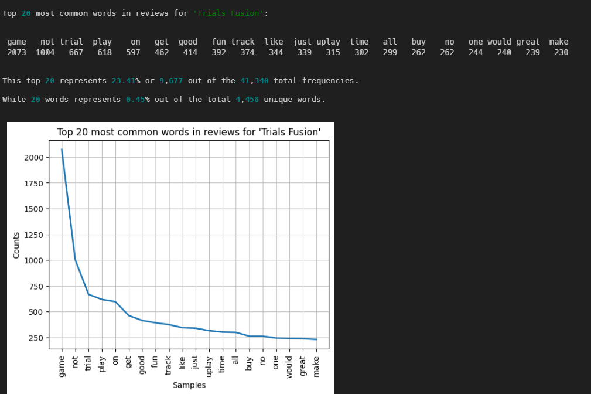
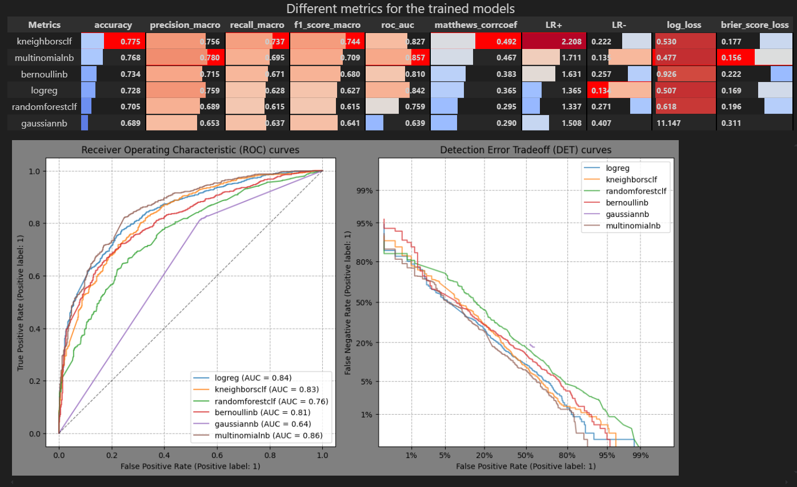

# ECM514_CD

Projeto do segundo semestre da disciplina ECM514 - Ciência de Dados. Classificando reviews de jogos na Steam usando TF-IDF e classificadores do scikit-learn.

## Requerimentos

O projeto utilizou a versão `Python 3.11`, embora não seja especificamente necessario utilizar as mesmas versões para fazer uso desse "pacote", é necessario um ambiente igual para utilizar os modelos "pickled" (salvos).

## Instalação

- Clone o repositorio para uma pasta vazia
    `git clone <url>`
- Abra um terminal e entre na pasta com o repositorio
    `cd <path>/<para>/<pasta>/ECM514_CD/`
- Recomendamos usar o `Pipenv` para baixar as dependencias. Use o comando `pipenv install`, lembre de estar dentro da pasta `ECM514_CD`
  - Alternativamente use o `pip`
        `pip install -r requirements.txt`

## Como usar

Via Streamlit app ou notebook

### Streamlit app

Abra um terminal de comando no diretorio raiz do projeto (`ECM514_CD/`) e execute o comando: `python3 -m streamlit run steam_reviews.py`

### Via Notebook

Por hora, utilize a função `run_all_task(<'nome do jogo'>, <'appid'>)`. É possivel passar outros argumentos para a função que controlam opções como salvar e carregar modelos pre-treinados. O output traz uma visualização dos termos mais frequentes e um relatorio com metricas do desempenho de diversos modelos.

Visualização dos termos mais frequentes:

Tabela e grafico:

Wordcloud:

Relatorio das metricas:

